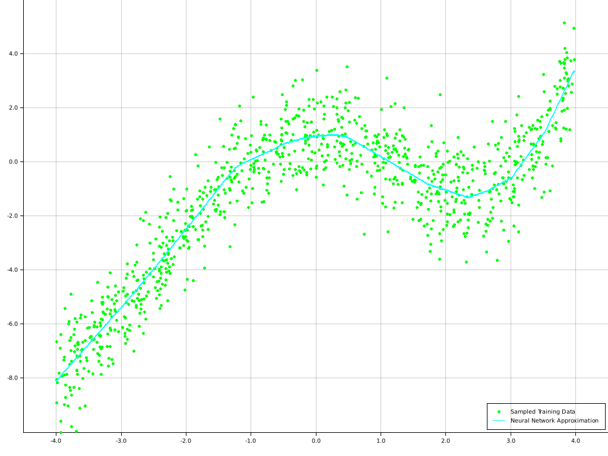

# regression-plot

Fitting a basic neural network to samples of a simple functions using the [tch](https://crates.io/crates/tch) crate. The resulting predictions for the training samples are shown in a created plot looking like the one below.

